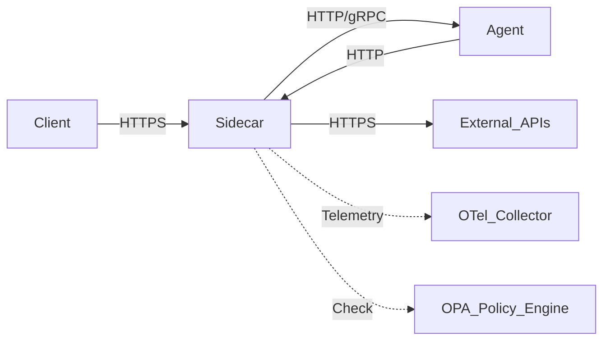

# AgentOS Sidecar Pattern

The Sidecar Pattern is a core architectural component of AgentOS, enabling consistent observability, security, and governance across all agents regardless of their implementation language or runtime.

## Architecture

In AgentOS, the sidecar (typically Envoy or a lightweight Go/Rust proxy) sits alongside the agent container. All ingress and egress traffic flows through this sidecar.



## Responsibilities

1.  **Telemetry Collection**: Automatically captures request/response metrics, traces, and logs without requiring code changes in the agent.
2.  **Identity & Authentication**: Validates mTLS certificates and JWT tokens before requests reach the agent.
3.  **Policy Enforcement**: Intercepts traffic to enforce OPA policies (e.g., "No PII in output", "Allowed external domains").
4.  **Traffic Management**: Handles retries, timeouts, and circuit breaking.

## Implementation Options

### 1. Envoy Proxy (Standard)
The standard implementation uses Envoy with a custom configuration.

**Config Location**: `infra/sidecar/envoy.yaml`

### 2. Flex Sidecar (Lightweight)
For resource-constrained environments, we provide a lightweight Go-based sidecar.

**Source**: `services/sidecar-proxy`

## Deployment

The sidecar is injected automatically in Kubernetes via a MutatingAdmissionWebhook or defined explicitly in `docker-compose.yaml`.

### Example Docker Compose
```yaml
services:
  my-agent:
    image: my-agent:latest
    networks:
      - agent-net

  sidecar:
    image: agentos/sidecar:latest
    network_mode: "service:my-agent" # Shares network namespace
    environment:
      - AGENT_PORT=8080
      - OTEL_COLLECTOR_URL=otel-collector:4317
```
